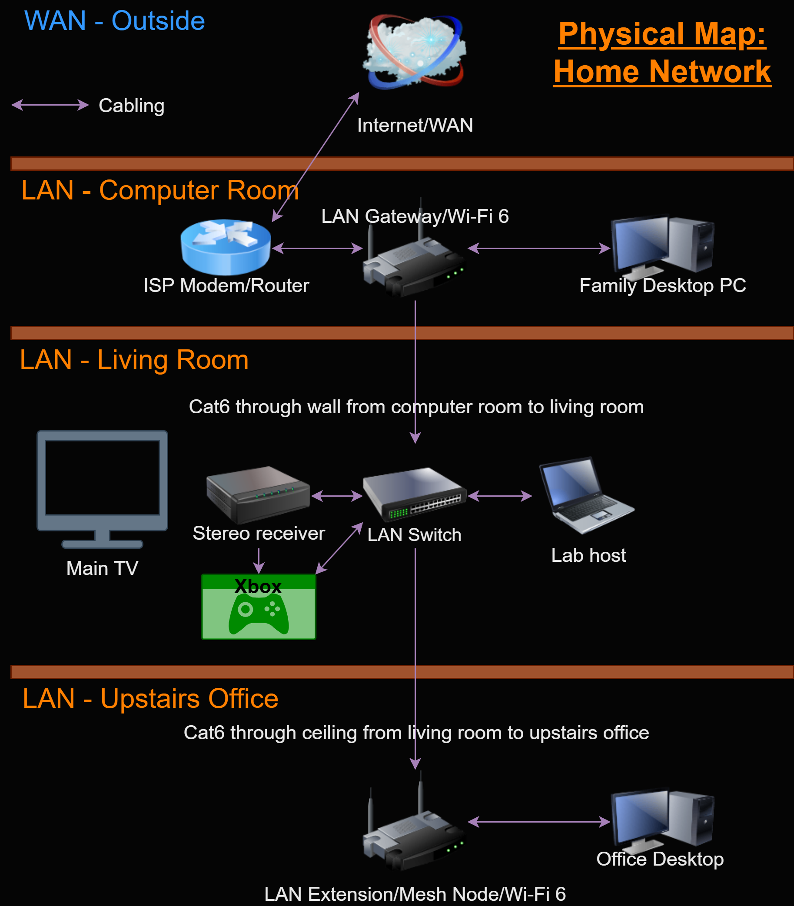
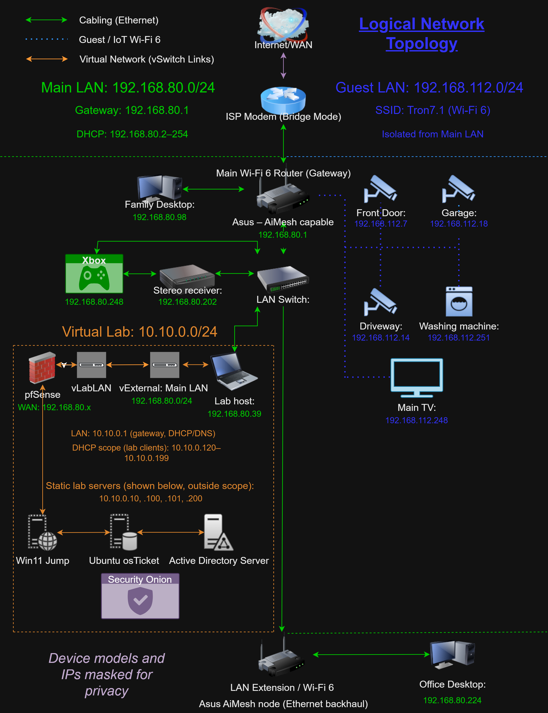

## Kev's IT Portfolio

This portfolio describes the home lab I designed and built to strengthen my practical skills in IT support, networking, and security.  I use a hypervisor on my own hardware to run multiple virtual machines, simulating a real-world small business environment.

Users connect through a firewall to internal services via a Windows 11 Jump box. This provides access to an Ubuntu Apache server running osTicket, a Windows server running Active Directory domain, and a full Security Onion monitoring stack. Each component was installed, configured, troubleshot, and documented by me to reflect real-world IT workflows and decision making.

## Lab Sections

## Network Topology (Physical and Logical)
This section documents the physical layout and logical segmentation of my home network, along with the VLANs, firewall, boundaries, and routing paths of my home lab.
### Physical Topology

*This diagram shows the actual physical layout of my home network, including the ISP demarc, firewall/router, switches, access points, and where my home lab resides within the network. This demonstrates my understanding of hardware placement, cabling, and how choices affect performance, reliability, and scalability.*

### Logical Topology

*This diagram shows the logical structure of my home network, highlighting traffic flow through my virtual lab. It documents DHCP scopes and VLAN segmentation via pfSense, and multiple lab servers all monitored by Security Onion. This demonstrates my ability to design, secure, and document enterprise style network environments.*

# pfSense Firewall and VLAN Segmentation
# Windows 11 Jump Box
# osTicket on Ubuntu
# Active Directory Domain
# Security Onion Monitoring
